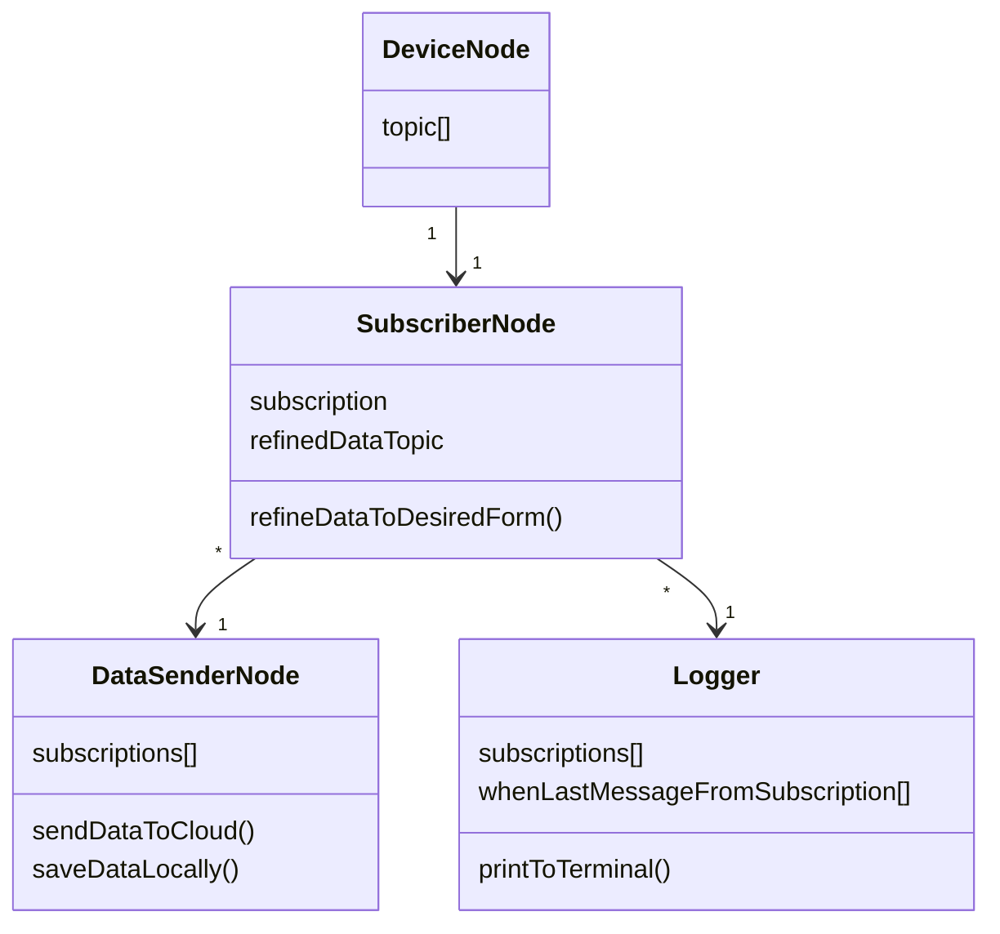

# ros-device-control

## Dependencies

```bash
# Do not care if this says you have already created it, its okay.
rosdep init

# Update
rosdep update

# Install package dependencies (Must be run in the ROOT folder).
rosdep install --from-paths src -y --ignore-src
```

## Building

```bash
# This must be run in the ROOT directory
colcon build
```

## Running

```bash
ros2 run <package-name> <node-name>
```

## Docker

```bash
# Build image
docker build -t ros-devices .

# Run container
docker run --device=/dev/video0:/dev/video4 --network=host ros-devices:latest
```

## ROS node architecture


